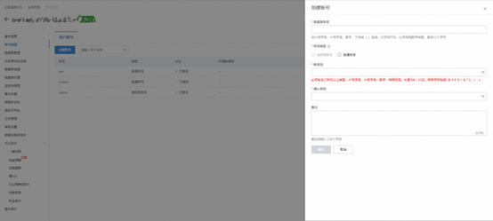
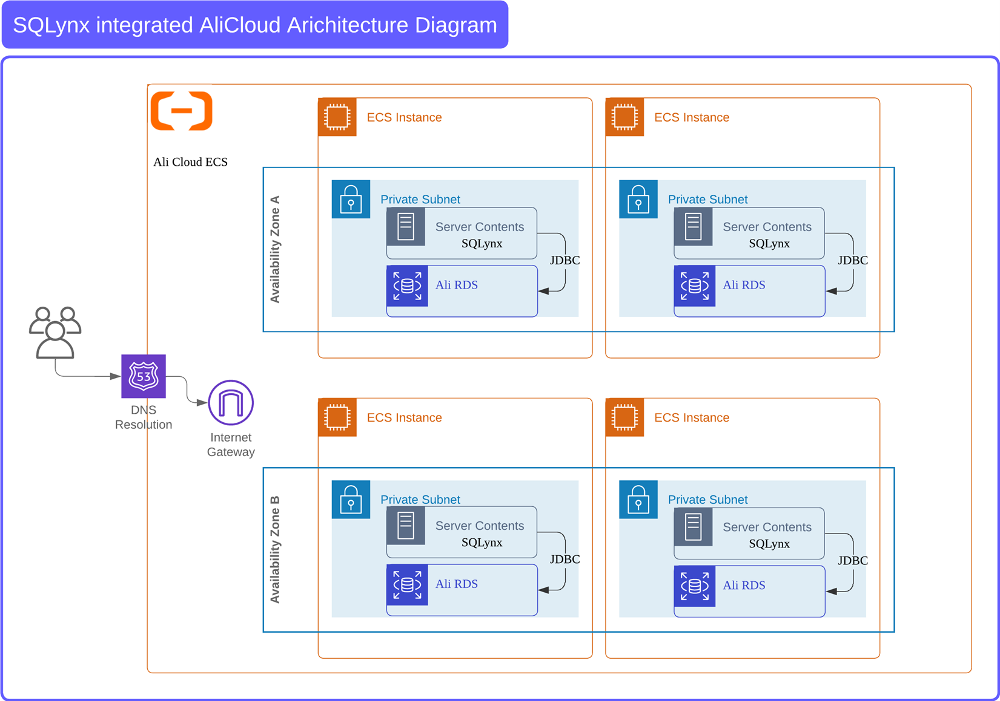
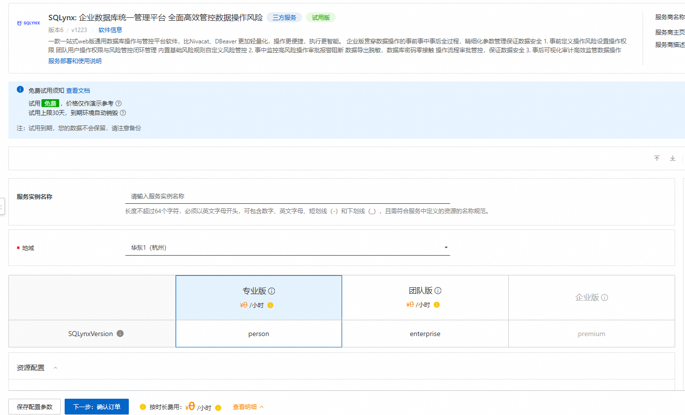
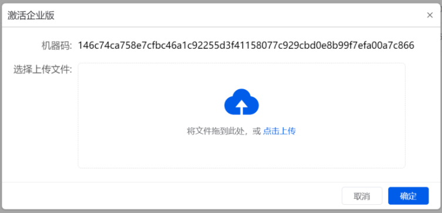

# SQLynx部署安装使用手册

[SQLynx](https://www.sqlynx.com/zh-cn/)，是一款一站式Web数据库管理平台，支持分布式部署和远程访问，具备SQL历史查询、导入导出、测试数据生成及数据对比等功能。审计、权限和风险管理增强了对企业OLTP场景的支持。SQLynx兼容主流及国产数据库，适用于Windows、MacOS、Linux及国产操作系统。

---

## [如何部署]()

部署SQLynx最新3.5.0版本服务实例，需要对部分阿里云资源进行访问和创建操作。因此您的账号需要包含如下资源的权限。  
**说明**：当您的账号是RAM账号时，才需要添加此权限。

### 权限策略配置

| **权限策略名称**                | **备注**                                  |
| --------------------------------- | ------------------------------------------- |
| AliyunECSFullAccess             | 管理云服务器服务（ECS）的权限             |
| AliyunVPCFullAccess             | 管理专有网络（VPC）的权限                 |
| AliyunROSFullAccess             | 管理资源编排服务（ROS）的权限             |
| AliyunComputeNestUserFullAccess | 管理计算巢服务（ComputeNest）的用户侧权限 |

因为服务可以选择不同的实例资源，其中包含您本地已有的ECS资源或RDS资源
因此，在服务创建之前，请您确保您部署的ECS实例上的安全组配置和RDS资源的基本配置。

### ECS安全组配置

| **授权方向** | **授权策略** | **IP** **协议** | **端口范围** | **优先级** | **源IP地址段** | **描述信息** |
| -------------- | -------------- | ----------------- | -------------- | ------------ | ---------------- | -------------- |
| ingress      | Accept       | TCP             | 3306/3306    | 1          | 0.0.0.0/0      | MySQL        |
| ingress      | Accept       | TCP             | 18888/18888  | 100        | 0.0.0.0/0      | SQLynx       |

首先，为了保证服务部署后，能够成功连接不同IP的数据源，您需要在ECS的安全组中配置数据源的ip和port。目前内置安全组只包含MySql连接端口。
此外，企业版用户若需要使用账户中已存在的RDS资源作为服务后端数据库，是RDS_MySql更好地兼容SQLynx的功能，需要提前配置好账户中已存在的RDS资源中的用户以及RDS白名单内需要配置使用SQLynx服务是需要连接的数据源IP。

### RDS配置

1.已经存在的RDS需要在账户管理中创建一个高权限的账号用户  
2. 白名单设置中添加您部署的ECS实例ip、需要连接的数据源IP或者全部开放：即将 0.0.0.0/0 加入白名单。白名单IP段设置为0.0.0.0/0意味着对公网开放。  

## [计费说明]()

|        | **半年**     | **按年**   |
| -------- | -------------- | ------------ |
| 专业版 | 520/人    | 999/人 |
| 团队版 | 999/人   | 1999/人 |
| 企业版 | 请与我们联系 |            |

## [部署架构]()

企业版SQLynx与阿里云的集成架构设计旨在通过灵活的部署方式来实现高效的服务交付。首先，用户需要一个阿里云账号，并通过计算巢平台配置云服务器（ECS）和数据库（RDS）等基础服务。SQLynx的部署可通过三种方式实现：一是将ECS与RDS配合使用，服务模块部署在ECS，数据库为私有化的RDS服务，SQLynx通过拉取在计算巢的部署物进行初始化部署和使用；二是使用公共RDS服务，连接方式为多对一；三是轻量化单机部署，将SQLynx直接安装在已有的ECS上，使用内置的Sqlite数据库。此架构简化了ECS实例的创建与管理，支持自动化部署，并通过安全组设置来管理网络访问，确保系统的安全性与稳定性。
 

## [参数说明]()

| **参数组**   | **参数项**           | **说明**                                                                                                                      |
| -------------- | ---------------------- | ------------------------------------------------------------------------------------------------------------------------------- |
| 服务实例     | 服务实例名称         | 长度不超过64个字符，必须以英文字母开头，可包含数字、英文字母、短划线（-）和下划线（_）                                        |
|              | 地域                 | 服务实例部署的地域                                                                                                            |
| 版本选择     | SQLynxVersion        | 三个版本的SQLynx_3.5.0版 [ ] person[X] enterprise[ ] premium                                                                  |
| 资源配置     | CreateNewEcsInstance | 是否需要新建ECS服务作为SQLynx部署的服务器 若选择是，则需要对ECS实例资源进行配置 若选择否，则需要选择账户内已存在的ECS实例资源 |
| 付费类型配置 | 付费类型             | 资源的计费类型：按量付费和包年包月                                                                                            |
|              | 购买资源时长周期     | 选择按月/按年                                                                                                                 |
|              | 购买资源时长         | 当购买资源时长为Month时，Period取值：1~9 当ECS实例类型为PrePaid有效                                                           |
| ECS实例配置  | 实例类型             | 可用区下可以使用的实例规格                                                                                                    |
|              | 系统盘类型           | [ ] 高效云盘[ ] SSD盘[ ] 普通云盘[ ] ESSD云盘                                                                                 |
|              | 系统盘空间（GB）     | 默认值为40                                                                                                                    |
|              | 实例密码             | 长度8-30，必须包含三项（大写字母、小写字母、数字、()`~!@#$%^&*-+=                                                             |
|              | Node节点数量         | 默认值为1                                                                                                                     |
| 网络配置     | 可用区               | ECS实例所在可用区                                                                                                             |
|              | VPC  ID              | 资源所在VPC                                                                                                                   |
|              | 交换机ID             | 资源所在交换机                                                                                                                |

## [部署流程]()

1. 云市场搜索SQLynx，点击试用或周期订阅服务 ，按提示填写部署参数。
2. 参数填写完成后可以看到对应询价明细，确认参数后点击 **下一步：确认订单** 。
3. 确认订单完成后同意服务协议并点击**立即创建** 进入部署阶段。
4. 等待部署完成后就可以开始使用服务，进入服务实例详情点击SQLynx链接。  

 

---

## [使用手册]()

[点击这里下载 SQLynx 用户手册](img/SQLynx_userHandBook.pdf)

> **激活企业版**

>  新采购/续费软件产品时，若需激活企业版，点击系统内设置按钮出的”激活企业版“获取机器码后，添加售后/客服微信或向售后邮箱内发送机器码获取 license 文件，，获取到文件后可在此处上传厂商提供的 license 文件，激活企业版 SQLynx。  
 
--

## 联系我们

- 欢迎访问SQLynx官网（[https://www.sqlynx.com/zh-cn/](https://www.sqlynx.com/zh-cn/）了解更多信息。
- 联系邮箱：[lyx@bjlongway.com](mailto:lyx@bjlongway.com)
- 售后微信/电话：18292683166

扫码关注微信公众号，技术博客、活动通知不容错过：  

 

---

最新更新于 2024/12/27